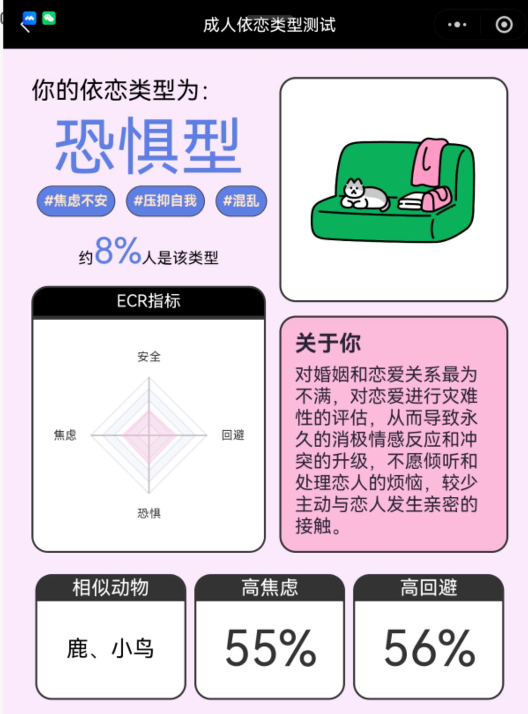
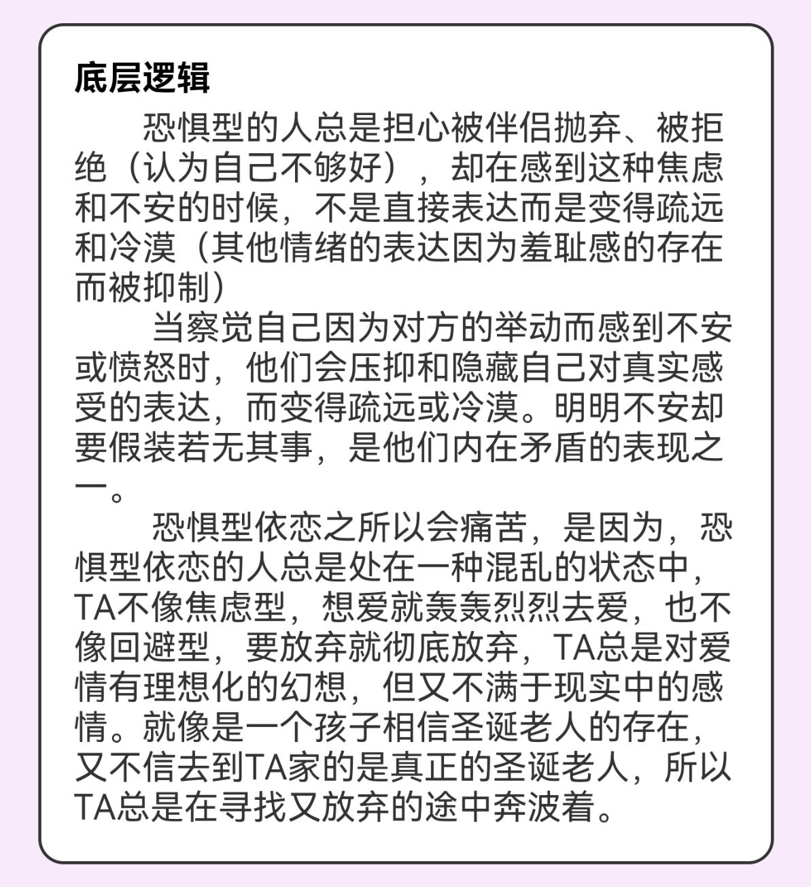

**桃2.24-返校、电话恋爱观念**

个｜身体、睡眠、饮食、运动

睡眠整体打分：7

睡眠行为与实际睡眠时长和时间点：1:14-9:34，八小时二十分钟

全部进食与时间点：

牛肉面（11:01）

达利园小面包（19:58）

饮食整体体验打分：3

总步数：

运动：0

十｜主线任务情况

看了半小时摄影书，但是因为心绪太过复杂其实看进去没怎么好好思考...

我以为我是需要看很多摄影集的人，找到自己喜欢的摄影家然后了解自己适合线上看还是买摄影集好了。

百｜新的状况or新的处理

以为寝室钥匙丢了担心了半个月原来是一直装在包里的吗。太好了。把那个冰淇淋pingu和钥匙挂在一起了，这样体积大一点应该更好记。

因为室友都没回来，3.1还有五天，就去交了50rmb电费自己用，跟室友们说了…应该算是好的人类处理吧。

但是罗桑并没有回我，应该可以确认她确实是很不喜欢我了。确认了就特别好了，之前还担心过好久。

吃面包没有看保质期，新选题，保质期的意义在哪里。

跟柯语音说了很多东西，这个人太会开会了很有结构意识导致我现在不觉得那是漫无天际的聊天，其实感觉这样是更好的。

依恋类型是恐惧型哎……

千｜out put

> 没有任何产出，一味的新增选题灵感大爆发。整体状态不太好，我一定要去一个晴天很多的地方自己住。

万｜情绪

到学校，阴天，所以无意义焦虑在床上半梦半醒六个半小时，一些轻微拖延症。对集体生活有一种并不需要完全对自己负责的隐形思维。

开心的事情是mappa在上海要开中国第一家旗舰店了，其实我现在的预期是我可能不会去，但是这毕竟是开心的事。

和柯电话是一种平静态，我喜欢自己好好把混乱的思考变成说出来的话的过程。但是依旧嗓子不妙。
