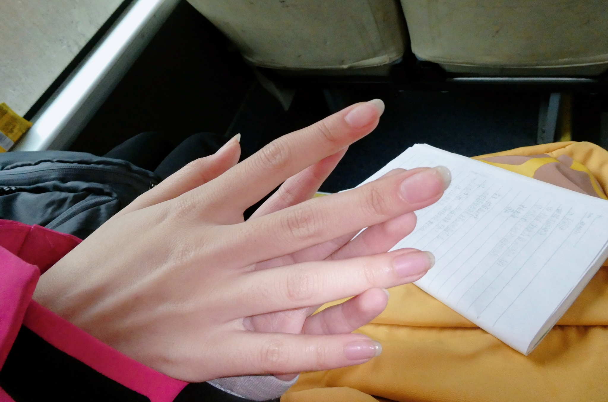
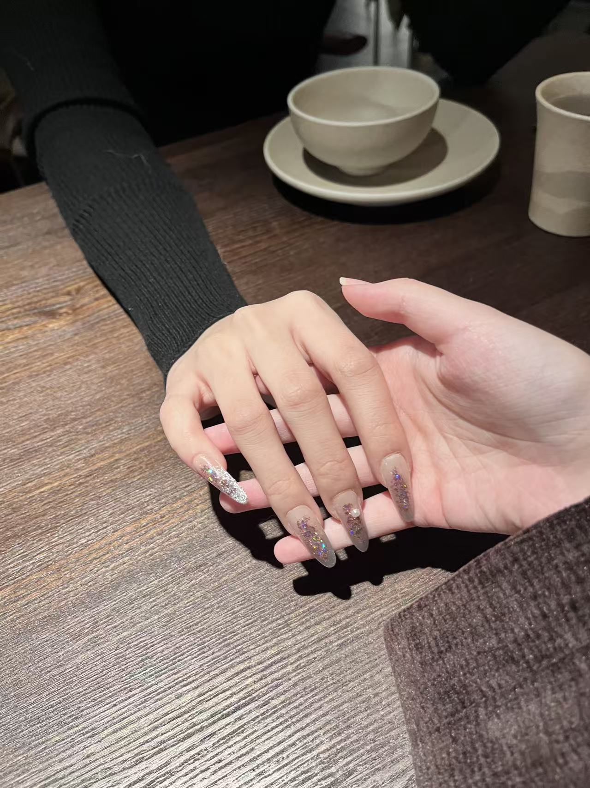

**桃3.16-话语含水量**

个｜身体、睡眠、饮食、运动

睡眠整体打分：3

有无不适：

醒来眼睛不舒服

比较冷……？野外课的时候基本没怎么写东西

脖子痛，比较渴，依旧不健康的一天

睡眠行为与实际睡眠时长和时间点：5:10-8:06，三小时

全部进食与时间点：

8:20，饼干和香蕉

12:49，炒河粉

18:00，依旧炒河粉

饮食整体体验打分：4

总步数：9805

运动：无

十｜主线任务情况

> 今天修图大概用了一个半小时，做了一张比较好看的拼贴，其实是用可画的第1天？
>
> 发现了可画AI抠图功能其实蛮好用的（对了，前几天充了醒会员），以及最后想做的真正的效果…就是不是给别人拍的照片的那一张，因为图层不能选叠加滤镜，跟ps不一样嗯。
>
> 没有做出来比较好的效果。当然也有可能是因为我对这种叠加的原理并不了解，一直有一种很奇怪的自信，觉得只要全都试一遍，肯定能做出来。

是发现其他朋友的手各长各的样子……但我还是会更多看我自己？果然并不是你的手，我记得你的手指甲是上翘的

但是应该喜欢这样的照片。

百｜新的状况or新的处理

补着整理了前面5天的日志。

> 之前好像因为天气太冷会待在寝室多一点，加上我比较依赖语音输入日志，所以整体没有写很多，10-15日那几天都记得不是很完整，当然最坏的情况就是，在toggl里面没有记那个时间在做什么事情，导致今天想补的写日志的时候发现，13日晚上会有几个小时是空着的，不知道那个时候做了什么。

跟快递公司打电话改了那个寄错地址的快递的最终送达地点。其实还挺顺利的，早上零零碎碎的抽时间就解决了这件事。当然我不知道最后的结果是什么样……反正好像觉得这件事已经结束了。好像其实并非。

定了以后9点开始停止输入，然后去写日志，10点之前写完。但是今天没有做到……因为9点的时候在跟柯腾讯会议，也算是不太有碎片输入的状态吧，所以今天晚上还是写了日志的。但是太晚了脑子不太好。

学校里比较喜欢的生活方式的人有点没礼貌……刘晓春？刘春晓？莫名其妙的跑过来问软件，借相机，完全没有真心在，很不好。讨厌自己被轻视的感觉……但是为什么。所以这个需要问为什么吗……其实我会觉得20多岁还是人性未完全发展的阶段，所以宽容一点也无可厚非……可以意念上或者宏观上宽容，实际相处和决策期间还是要多注意自己的不适。

千｜out put

万｜情绪

-10，早上醒来的时候是8点，去刷了牙，然后吃饼干出去上课，今天车来的比通知的时间晚10多分钟，悠闲的买了新的草稿本。昨天晚上好像不开心，所以就睡得很晚……而且昨天下午下雨也拍到了想拍的东西，所以就没有那么珍惜今天的雨天，总的来说是不好的开局。

10，和不喜欢的同学说了，让她以后不要再找我聊天了。嗯，虽然说的很直接，但是还是怕她听不懂，希望以后不要再过来了……不想跟她说话，也不想听她说话。

30，听课，听不懂。测产状，学会了（太好了了，测倾向要用镜子的那面把圆的水平珠调到中心，然后读白色的针读数（还是黑色的来着）。测倾角的话要用罗盘侧面贴在岩石的层面上，用背面那个调节的把水平柱的珠子调到水平的位置，然后读里面的那一圈数字。）。和两个女同学比较认真的聊天性格、就业，这样，变得会看到他人了，很好。

35，和同学了解一下目前班级的人类构造，虽然在晚上写日志的时候已经基本忘掉了……但是记住了他们的分享。

50，做出了比较满意的人像拼贴……但是最喜欢的一张图片还是调的是胶片色调，我觉得找到自己的调色风格是比找到拍照风格更难的。其实我到现在都不确定我是不是喜欢调色这件事情……疑似还是更喜欢直出吧，但有些时候也更喜欢有调色空间一点。

> 就是有心思后期的时候。所以还是尽量提高原片的构图和背景吧，是很重要的决定我后期有没有心思去认真对待一张图片的因素，其实就是看它的潜力最漂亮，能到什么程度。

70，好像久违的和柯老师腾讯会议了，对我自己这几天在考虑的读研问题有了比较好的分析。感觉是很好的，因为是跟老师或者自己都不会分析到的原因，我没办法过没有社会身份的生活（高中生本科生研究生公司职员这样），或者不是没办法过，是觉得没法跟家里交代。

> 不过他很很有点ai感，很神奇……会让我想起来之前用AI写同人文的时候？有一点害怕吧，不要ai，不要太固定，保持部分未知和不被操控的人是好的。你好，我是 ai（笑），所以我这种形象会出现在你的同人文作品里吗，好奇 ing

40，腾讯会议结束感觉很累，尤其是脖子很痛，因为没有找到可以稳定的存在的地方，所以随机的找个地方坐，还有在路上行走，身体比较累。整体有一种会议感，我觉得有些问题他问的比较直接……是好事，但是感觉推荐柔和一点人类一点，举例，What can I do for you / What do you need me to do ➡？（还没有舒适提问样本，不知道）。 原来这些问题是直接的事情，唔，其实可能是我目前这些状态就是很直接的说话。

认真讨论了一些事情，友谊测评，合同修改……察觉到一些很清晰的陌生感，我真的在创造一些之前生命里没有过的东西吧。

零 | 好的和坏的

NICE

比较主动的接触和创造了一些，我觉得这已经成为了一种惯性……很好。不是很消耗意志力，很自然的就去做了。这意味着我之后可以把意志力用在一些我更希望努力的地方。

Bad

早上是在下雨的，但是还是在把相机背在胸前……松下是不防水的，还是要多注意。（这个时候终于反应过来，为什么脖子痛了……背相机就是最惨的？加上昨晚也没睡好）

这两天用flomo记录的东西很少，几乎写日志回看的时候没法拼凑齐一天。当然也是太累了，而且集体生活不方便语音输入的原因……还是希望多留下印记。

[3.16，读研、测评、合同修改、视频合作](https://my.feishu.cn/wiki/X8ZjwJXccioBzkkVBA3cnbjXnUb)

请开权限www或者直接复制粘贴全文哈哈哈
