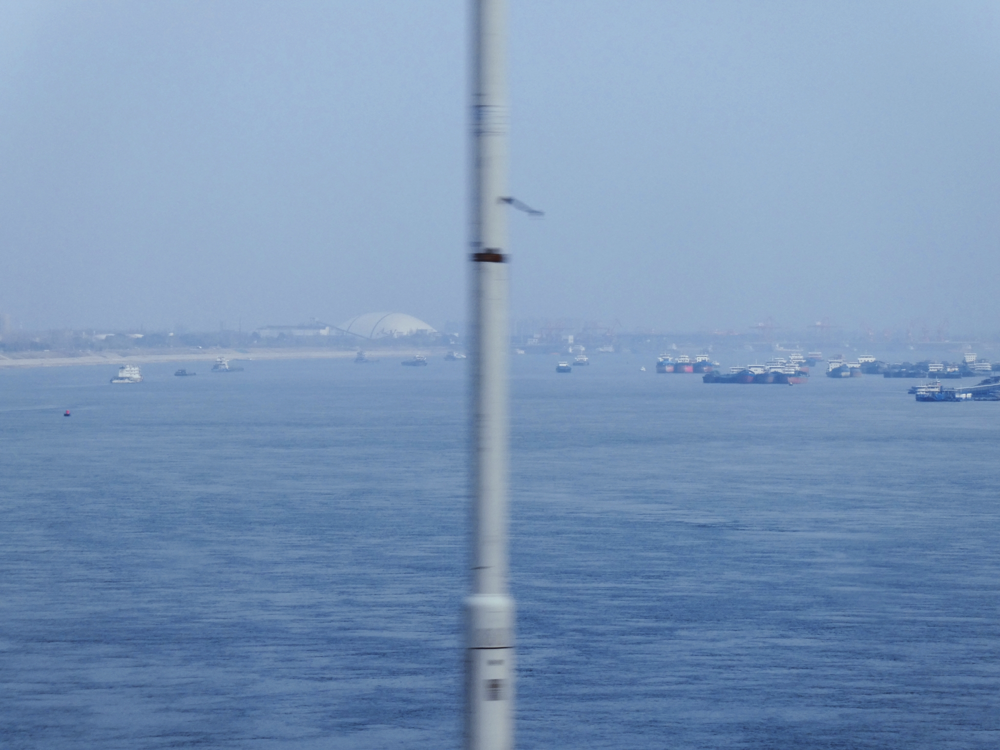

**桃3.5-肉体、周边的世界**

个｜身体、睡眠、饮食、运动

睡眠整体打分：8！熄灯是好文明！但是感觉之后一个月需要闹钟了，醒来有点晚了。

有无不适：

感觉腿一点点难受，背和后腰痛一点（不过感觉都是那种突然路走多了的没有大碍的痛）

晚上眼睛有一点干……今天好像风不太大，也没有很晒，所以是看屏幕看多了？（如果真的排除剪头发的时候可能被吹风机吹到了的话）

睡眠行为与实际睡眠时长和时间点：0:19-8:38，手表说一点睡着，所以是睡了7个半小时。

全部进食与时间点：

9:43，香蕉＊2，一根比较酸，一根比较甜，完美搭配了（并没有……因为是分开吃的）

14:17，黄焖鸡（一半）米饭（纸盒子一份），缺点是很辣，湖北人不理解不要辣椒吗，上次点的黄焖鸡更是辣，怎么事

19:10，华莱士汉堡（炸鸡好咸哦……）和地瓜条（没有甘梅粉，所以吃的不是很开心，后面蘸了番茄酱）

饮食整体体验打分：6，很主动！这个夸！但是缺点在于没有太用意识关注自己的身体，在很吵的环境（归因）里面好像无意识吃到有点难消化（？）那怎么办啊

总步数：2987

运动：健康拉伸背一会会，然后尝试了新的运动，太震撼了居然能感觉到自己的下腹肌吗。但是明天要出门实习走很多路，今天还是不要练了，待会可以拉一下腿

十｜主线任务情况

> 学了大疆nano官方教程。
>
> 用平板下载了dji mino，不过后来在车上没怎么看得进去，但是因为对设备很感兴趣，还是获得了一些新的用法吧（log和可以遥控拍照）

百｜新的状况or新的处理

因为基本算是第1次住多人寝室，所以有一些东西很不了解。有人在寝室里吃饭，我觉得有点不太舒服，问了比较熟的朋友是什么情况，她说这个是正常的，需要适应。所以后来就接受良好（吧，总之下午很快出门了）

高德地图我喜欢你……发现从小就是用这个地图来探索各种地方，有导航的就可以去。很棒，不要害怕城市啦。而且看了路线更加了解城市布局和规划了，我们在城市的西南方向，离的也不远，一个小时左右。

很快的找了一家剪头发的店去剪了，是从小红书上搜的，发现了这个软件的新的意义。

剪的时候是全程在拍的，并且因为在拍，所以更好地表达了自己的需求（当然这个也是因为在路上提前思考和整理过）。我很想可以回看自己稍微勇敢一点的样子（或者担心和害怕的样子也特别好），所以拍视频真的很适合我吧。更多学着镜头稳定一点吧。哇塞哇塞，所以原来相机居然可以是安全感的来源，(*￣▽￣)d

发现有些东西更适合用语音记下来，有些东西就更适合写字。写字适合一些不太能说出来的，晦涩的隐秘的东西（需要慢慢想才能蹦出来一个词的那种），但语音转文字的话会更全面的记录思考过程和再现场景。

千｜out put

一些关于安心感的思考。

在很长的时间里努力带来的感觉是坠落，恐慌和不安。

我以为自己是一直追求安心的人，把那种毛绒绒的感觉叫做幸福。其实或许是生物本能而已。

并没有很看不起。

发现它的过程塑造了我的态度，日均入睡时间需要三个小时左右，甚至能用遍历的方法回想一天。后来开始听着各种肉身相关的书来听，进化，消亡，变异，固化。

我不是好的地质学生，对计算的排斥和对英文字母的免疫致使我并没有对那些百万年有清晰的记忆和划分。

古生物学这个分支上稍好一点，是因为另一个 个人的特性，感官至上…任何日程记录都要可视化，任何文字都会带着对于体验记忆点描述。

触摸形体的质感，即使化石里甲壳里的灵魂已经离开很久，但它们带来一种无法抵抗的冰凉的战栗。

在想象些什么，想象我被啃食分解，想象用石头砸开这些骨，想象转世，想象与不可及的地球交融。被淹没，仍然可以呼吸。

这种肆意感很好入睡。

所以慢慢的我接受和理解了那种对安全感的追求，最好不要让自己的实体任意消损。

看清了之后发现这种追求有一些过于庞大，政治性的文化性的东西甚至被强加在这份本能上。我能想象一种不结婚依然可以呼吸的生活吗？我能想象一种真心认为绩点只是手段的观念吗？我能想象一种让喜爱的事物不空洞的现实吗？

我有见过吗…我能理解吗……

好像不只是勇气的事，或者说我之前只觉得勇气是种冲动，并不理解那种人类的赞歌就是勇气的赞歌。

它是自信和理智的混合体，长久的人性的不太可以忽视的，一定不混沌。

请长出一些坚硬的质感吧，未来的快乐。

这张图片是照着胶片色调调的（用的是醒图的曲线，基本上是第1次用。其实还好，不算陌生），但是最后把整体hsl蓝色拉的高了一点吧，因为很喜欢水的波纹，这种很细的。觉得它就应该是这种颜色，而不应该太浅太黄。

> 
万｜情绪

-10（早上听老师讲课和看课件，根本看不懂）

50（勇敢和快速的出门了，一天还很早）

0（回来的时候因为赶时间没有买到蛋挞，其实还是很想吃）

-40（晚上吃完饭开始写一些东西，感觉变得很混乱……而且不知道怎么办……我并不清楚自己的底线，并且为了探索它，在意识里做了一些现在的自己不敢触碰的事情，我还没敢和没来得及从那些经历里学到什么）

|  |
|:---|
| 尊重自己，就是觉得自己配得上过一个有尊严的人该过的日子，可以坚持自己的底线。 |

-10（安抚巾我想你……产生一些同甘共苦相关思考，安慰自己说不带它来受苦了，但又想它不应该在这个时候陪着我吗？）

10（拉伸和写日志，让自己的身体和思考都好好存在吧）

零 | 好的和坏的

NICE

稍微明确了主线，在不知道干什么的时候就可以去做这些事让自己回到一个正常的位置。

觉得各种软件和世界产生的交互是真实的，之后应该会更多的介入。

拍视频对我是好的。让这个行为变得更自然一点吧，感觉它会变成另一个让自己成为自己的加速器（毛老师用词）什么，聊天记录我要看

Bad

因为现实太慌乱茫然，所以主动的去产生一些社交，但是在他们回应我的时候在急于解决问题，所以说没有对他们很认真。主播😭所以说要回复废话的条例吗

感觉这两天花钱有点随意，应该这样吗……？不知道。需要记账吗？这个行为好像没有存在在我的生活里过。
