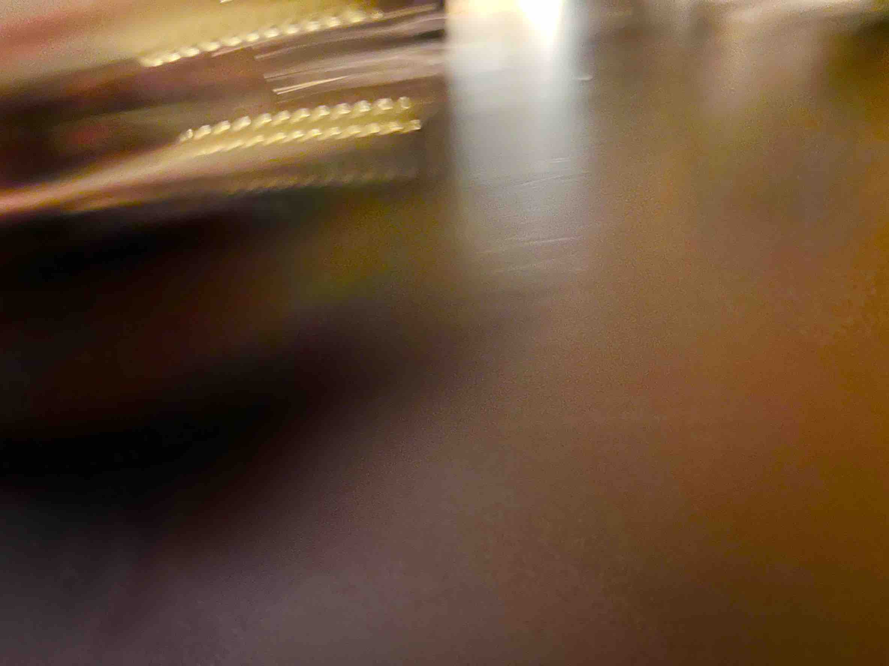

**桃3.6-请尊重自己**

个｜身体、睡眠、饮食、运动

睡眠整体打分：

有无不适：

死人一般的平躺睡，醒来发现腰痛背痛脖子大腿小腿后侧痛，笑了…

早上从山上回来，右边胳膊内侧比较痛，腰也是……总之很想很快恢复好😭很不想动了

睡眠行为与实际睡眠时长和时间点：12:33-7:10，六个半小时

全部进食与时间点：

7:48，汉堡。我需要热水……

9:56，糖，同学给的

12:10，香蕉1，好像从哪里听说练完随便吃点什么比较好？

12:56，牛肚饭半份，发现我对卤味的耐受度不太好，辣的也不喜欢……到底能吃什么啊以后

18:00，上面的半份，还有炸鸡翅1

饮食整体体验打分：6，还好，被情绪冲的不太记得了，但是没有不愉快。凌晨有点想吃东西和熬夜

总步数：5776

运动：无，啊啊啊sad

十｜主线任务情况

> 早上出去实习路线开了路线记录和拍视频了，把机身拍满了。
>
> 晚上吃完饭去会议室整理了素材，蓝牙有点连不上……烦

百｜新的状况or新的处理

实习回来睡了三个小时，身体恢复的还好，但是浪费时间的即视感特别的强，很难受晚上就，加上有作业要写。

感觉是因为没法预估写作业需要用的时间所以变得很焦虑（会觉得需要无限久，一定来不及），而且身体很累的话确实就会导致情绪不太好？

发现了和朋友打电话真的是很好的开始做事的方式，应该是一种平稳的引力。所以合同真的很有必要啊……在这种时候不要不安定的分开😭主播😭就是很好啊

因为发现下了一个电影17G，所以在清内存的时候说直接看了好了。想看很多电影很久了，但是总觉得要产出些什么，我比之前更加在意时间了吧，没法放任自己做毫无output的事情了……好不好呢，没有好不好吧，不喜欢现在的状态就去找目标然后调整就好了。

大疆的连接有一些问题，所以去问客服了。虽然客服是傻子、之后再处理吧，优先保证拍摄

下午睡了三个小时，尽管确实是因为身体很累，但是那种醒来的虚无感还是很恐怖，觉得白天不该这样睡觉，很怕回到之前对想做的事毫无进展的时候……（虽然后来会觉得只是因为对作业的焦虑蔓延了！而且之前寒假的时候其实做了很多事呢，还很开心。当然值得肯定的是调整作息是好事。

千｜out put

图片1，感觉色调不够漂亮，但是是安慰作用所以更重要的是即时性

> 
万｜情绪

50，早上醒来不是很难受。而且时间不紧急，这是很棒的

10，嗯……野外课其实还是不会和听不懂吧，说实话这是一个巨大的漩涡，我要不要首先思考很多，比如要不要再为这门专业花精力呢，还是好好想想再决定行为吧，反正这一个月就被定在这里了

-30，要写作业和5学分和手写和不会素描的，很大的无助感？而且过往的习惯让我不太会和同学求助吧

20，柯老师的伟大电话……

40，晚上其实想开一点，会觉得一切我不主动去做的行为就不会有改变，比如和同学交流，比如调节身体。

60，大脑也是肉体的一部分，所以脑可以休息，身体其他地方也要休息一下怎么了！睡了三个小时而已，要给他们多一点时间啊，好的身体是不可能天降的。但是我可以做的就是多去了解一下机制啊各种知识，预估一下时间，有一个大概的知情掌握，情绪就会好很多。

零 | 好的和坏的

NICE

起码尝试导出素材了！自己一个人出门去会议室做事不是很棒的吗！之前可是很少能主动出门的（其实更少被动出门吧，都很排斥

Bad

依旧没有写日志，第二天很多感觉都想不起来了，而且把第二天的时间投入到前一天让我觉得有一点点浪费吧……我是不是对时间太紧张了，感觉只有今天是活的，而昨天已经死了这样。应该算一种矫枉过正，稍微收一点吧，我不会做没有过去的人的，如果昨天能给今天带来思考和力量不是很好的事吗。
