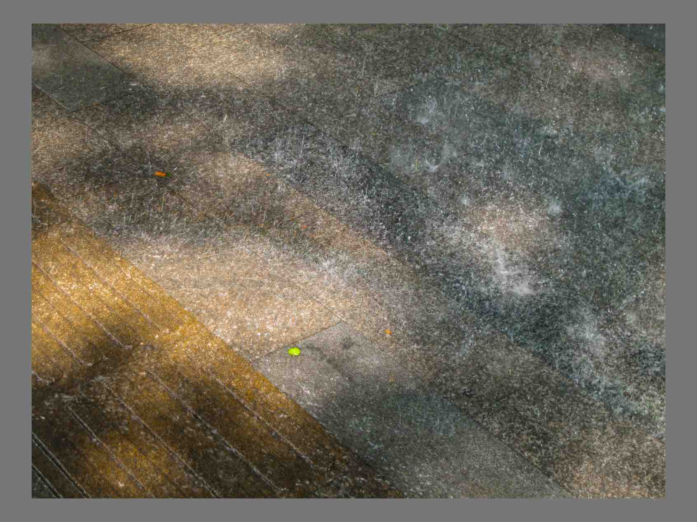
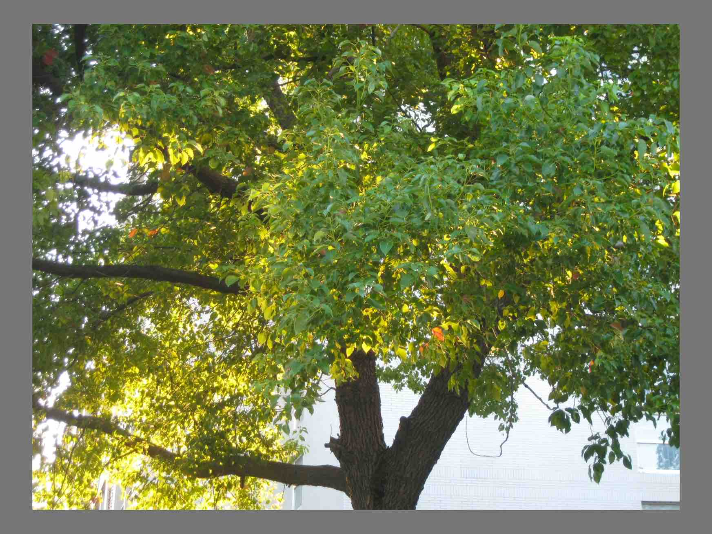
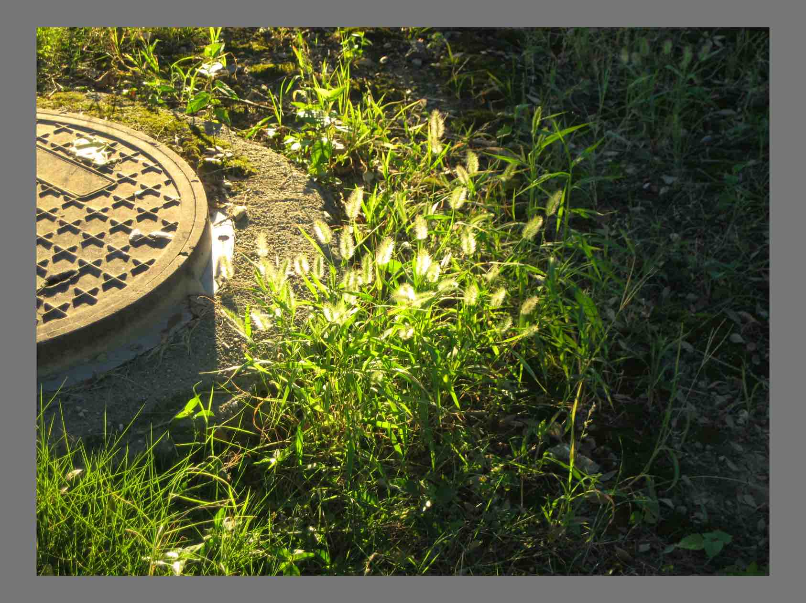
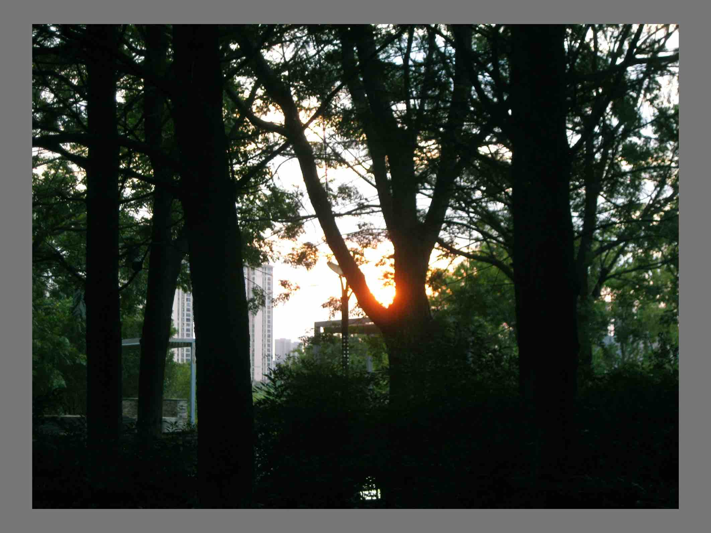
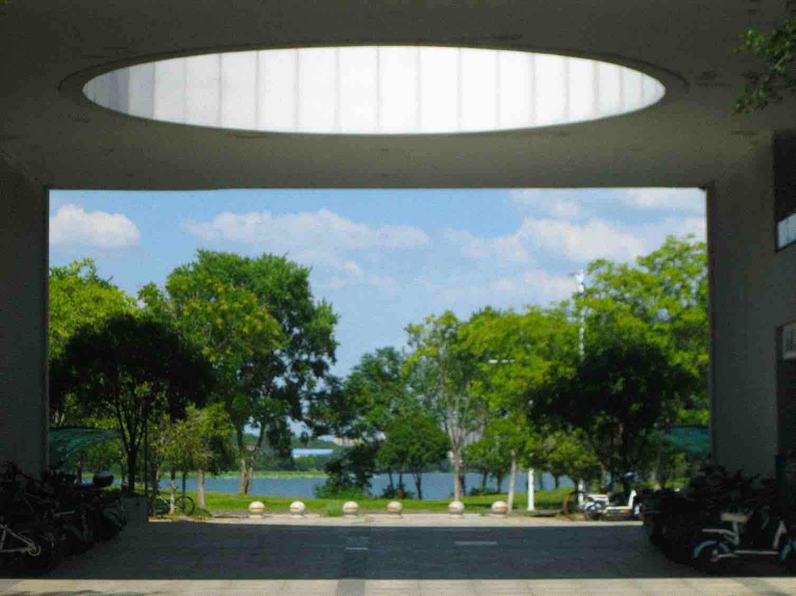

**桃4.1-学粤语和随意玩游戏**

个｜身体、睡眠、饮食、运动直接一个看，怎么今天是四号上次是 1 号，好快的时间

睡眠整体打分：7，醒来的有点晚但是还能接受，睡眠时长是正常的。

有无不适：

坐久了今天背好痛，需要一些拉伸运动吧，睡前去做

睡眠行为与实际睡眠时长和时间点：1:25-10:39，九小时

全部进食与时间点：

10:44，八宝粥黑米版，好久没喝变得好甜

15:53，青椒肉丝面！学校里喜欢吃的饭，但是外卖变得有一点油

22:10，煎饼！好吃但是好饱，太晚吃饭感觉还是不太好

饮食整体体验打分：我的食谱app居然是要收费的……我真是。考虑一下值不值得买吧，128买断

总步数：100，恩对是不太能动的，昨天回学校回来伤到了的那边脚踝会看到皮下出血

运动：0

十｜主线任务情况

> 拿到了电脑（阔别一个月这样）点开了之前存的一些图片数据文件夹。
>
> 非常的感动看到了佳能ccd拍的一些照片，然后就修了六七张当做春天（有时候在想应该对于拥有的一些设备做一段时间线）
>
> 听了一个小时粤语课，现在了解的学习语言的途径是先了解发音，然后是语法，then直接去看感兴趣的书就好了，目前来看效果还挺不错的，学得很开心。
>
> 跟乔宇老师聊了学籍的事情，本来想法是留一级，他直接给的方案是可以留两级，从挂科不多的时候直接开始读。
>
> 有录音，通义转文字一下记得。

百｜新的状况or新的处理

千｜out put

> 
