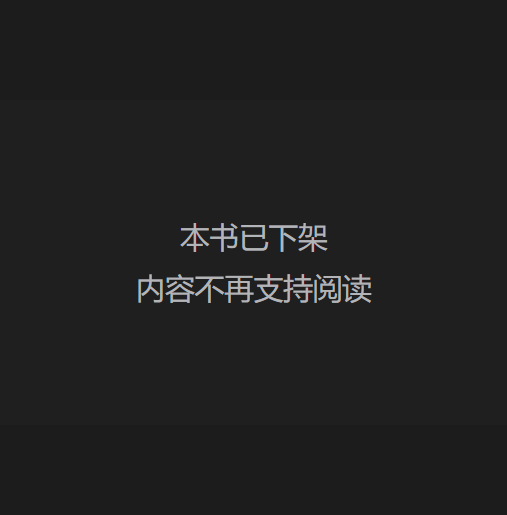

**桃4.2-变稳定一点…**

个｜身体、睡眠、饮食、运动

睡眠整体打分：6，没难受所以及格分

有无不适：

脖子痛和腰痛。那怎么办啊我要久坐的cryyy

哎等一下今天是月经日，所以痛是正常的，哦哦哦好的

早上没吃饭真的快饿晕了……原来我早上需要吃饭啊

睡眠行为与实际睡眠时长和时间点：

1:34-5:47，四小时左右，醒来也没马上下床的。但是很好的是没有在不开灯的时候看屏幕。

睡得好短，醒来有点恍惚，确认了挺久脑子还累不累，结果不太累就起来了。没关系我初步判断是因为0运动加上昨天睡了九小时。还是按照第三四五天平均睡眠定近期的舒适睡眠时长标准吧。

全部进食与时间点：

5:52，徐福记黑芝麻酥心糖*1，椰子水不知何时购入的100ml

12:18，猪脚拼肥肠饭，非常伟大的土豆丝，以及为什么觉得吃青菜就蛮健康的，好像每个东西都吃合适的量才算健康

23:36，麻辣拌不要辣版（生菜，西兰花，切片火腿，红薯条，娃娃菜。但是花椒真的存在感很高，这家好像变得不好吃了，也有可能是凉的所以不好吃）和中午没吃完的饭

饮食整体体验打分：6

总步数：哈哈哈还想着走路呢

运动：0

十｜主线任务情况

> 新建了一个YouTube账号，和柯希莫的一个共同账号。获取一些账号运营and油管使用经验吧，开心
>
> [Canopy dialogues/林间谈事账号的相关](https://my.feishu.cn/wiki/XtYjwUefNiVlEjkqRQqc3MABnbe)

百｜新的状况or新的处理

实在太困了没撑住，白天睡了四个小时，后来好像过得还不错？没有想象中的愧疚和醒来的身体不适。

我们把月经期视作一种正常的，需要接受和适应的状态吧，毕竟一个月也蛮久的，不能扔掉这部分生命（就是随意生活啦……要保持思考和多注意自己的状态，通过改进变得舒适一些高效一些）

小林纪晴的《写真学生》在微信读书下架了，我记得我还写了蛮多笔记的，就没有了（在导出flomo的时候发现下架了），不知道怎么办……以后及时记录吧还是

伯母评论了朋友圈，很意外她会看，其实她和伯伯好像一直会看我朋友圈，但是我没有主动联系过他们。长辈对我有好感是好事吧，以后随便开始主动接触一下（节日祝福什么的）就能产生好的有价值的联系了

谷歌浏览器怎么这么好用……搜了一个书名＋pdf，看见一个，点了一下直接给我下载好了一键导入微信读书了（平板端整体操作的），顺滑程度太震撼了，平时都要zlib＋手动导入的

卡琳娜在乘风破浪的姐姐里面谈恋爱了这个事情就上各种新闻，但是我突然在关心的一个事是她之前cos了无期迷途的一个角色。在一个公开的展会上，可能是哔哩哔哩 world吧。
那么它的定价是怎么样的？游戏方是怎么邀约到coser的？
就是游戏方式怎么给这个coser，个人工作者定价的？
这个我还挺好奇的。

# 对自己个性的观察/观念
不知道很真自我的活法是否适合每个人，就像特别无力的一段时期是发现努力探索之后的道路和家长规划的是一样的（此处举例仅因为我一直特别不想听他们的话，所以这种情况会难过）
重要的…重要的是找到平衡吧？在成全自我和献祭自我之间（天呐好想多多访谈获得真实的情况）

千｜out put

一条朋友圈

第一次成为微信读书受害者

